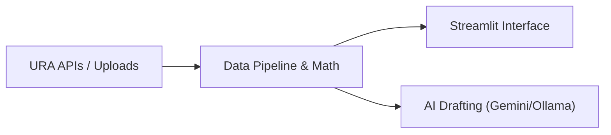

# Real Estate Feasibility & Land Underwriting POC

A quick Streamlit prototype built to run locally on your system to help the acquisitions team at ABC Development Group evaluate potential land sites in Singapore. 

Rather than spending hours manually pulling comparable transactions from the URA portal, copy-pasting developer pipelines from PDF reports, and running cash flows in standalone Excel sheets, this POC pulls live market data and runs underwriting math in a single workspace.

---

## The Problem & The Solution

* **The Problem:** Assessing a new site is slow and manual. Analysts have to log into different portals for historical sales data, look up zoning laws, estimate competitor pipelines from broker reports, and build financial underwriting templates from scratch. This leads to slow turnaround times and inconsistent bid proposals.
* **The Solution:** This tool automates the grunt work. It takes a target site location, pulls transaction history around it, identifies pipeline competitor projects, runs a residual land value bid model, and generates a draft investment memo.
  * **URA Data Sourced:** Queries URA's private residential transaction API (`PMI_Resi_Transaction`) to extract transaction records (prices, sizes, storey levels, dates, tenure, and sale types). The pipeline can be extended to support other data providers in the future.



---

## Code Structure

* **`app.py`**: The Streamlit interface, including interactive maps and layout.
* **`data_pipeline.py`**: The backend logic. Handles spatial calculations, statistical aggregation, and the residual bid calculations.
* **`ai_analyst.py`**: Sets up prompts and handles calling the LLM (Gemini Cloud or local Ollama) to draft the qualitative memo.
* **`schemas.py`**: Pydantic schemas that structure our unified data record.
* **`analytics.py` & `geospatial.py`**: Code for Plotly charts and Folium map rendering.
* **`URA_client.py`**: API helper to authenticate and fetch transactions and pipeline data from URA.

---

## Design Decisions

* **Singapore Residential Scope**: I restricted the current scope strictly to Singapore residential land sales. The specific use case would allow development analyst to assess whether a plot of land is worth bidding for the sake developing private residential properties.

* **Computation**: To avoid AI math errors, all calculations (GFA, average PSF, and residual land bids) are executed deterministically in Python. The LLM is used only as a formatting assistant to draft the narrative report.

* **Data visualisation**: I also included some charts using past transaction data to show the market demand in a particular area and also pricing trends. The intention is for the AI component to automatically read the charts and give users an insight.

* **Local LLM for Cost & Testing**: We integrated local Ollama (Llama 3) support primarily to save on API token costs during testing and development, allowing offline debugging without running into cloud API rate limits.

* **Offline Fallback**: If LLM API keys are missing or rate limits are reached, the app falls back to a rule-based text generator that builds the memo structure programmatically.

* **Workflows integration**: The intention is to work alongside existing workflow by an analyst, allowing data downloads back into excel and intuitive UI. The eventual output is a report giving users a high level run down of the risks and opportunity.

---

## How to Run It

### 1. Set Up
```bash
python -m venv venv
venv\Scripts\activate  # On Windows: venv\Scripts\activate
pip install -r requirements.txt
```

### 2. Configuration
Copy `.env.example` to `.env` and fill in your keys:
```ini
GEMINI_API_KEY=your_key_here
URA_ACCESS_KEY=your_key_here
USE_OLLAMA=False
```

### 3. Run
```bash
streamlit run app.py
```

---

## Next Steps
* **Advanced Layout & Scanned PDF OCR**: Upgrade the built-in basic PDF text extractor to support scanned documents, zoning tables, and architectural drawings using OCR or multimodal models.

* **Data from URA** : Expand into other data types provided by URA

* **Future Data Providers**: Extend the data pipeline to integrate alternative data sources (like EdgeProp, OneMap, or commercial real estate databases) beyond URA.

* **Proposal Archive**: Connect a vector database to search and reference past proposals and bids.
